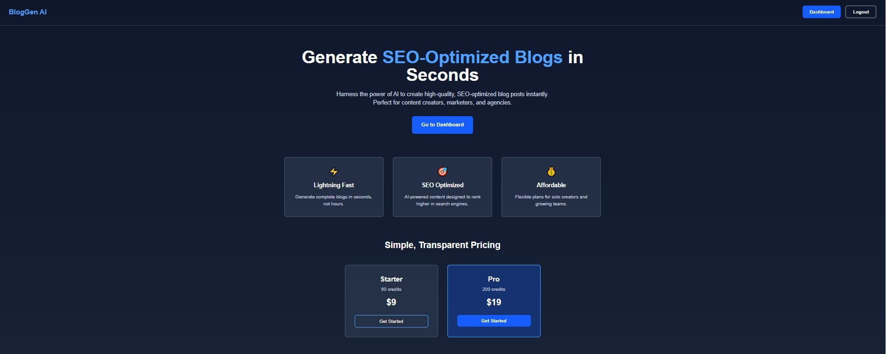
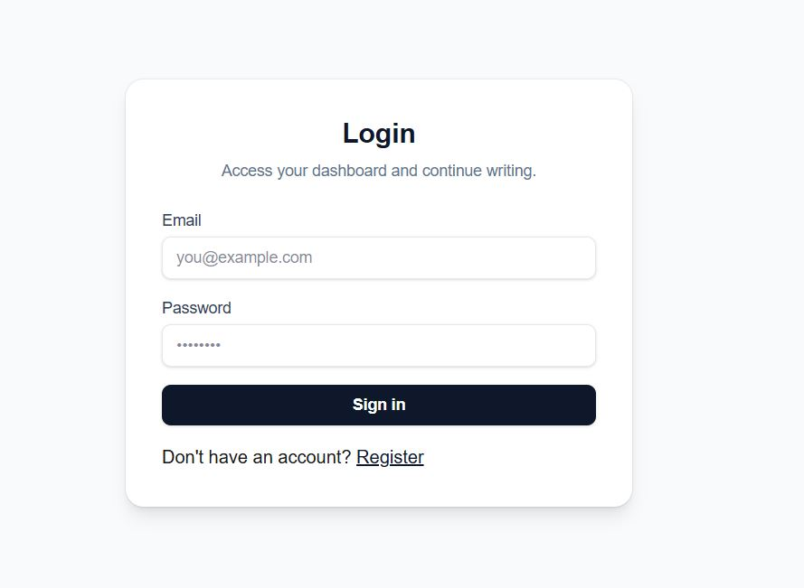
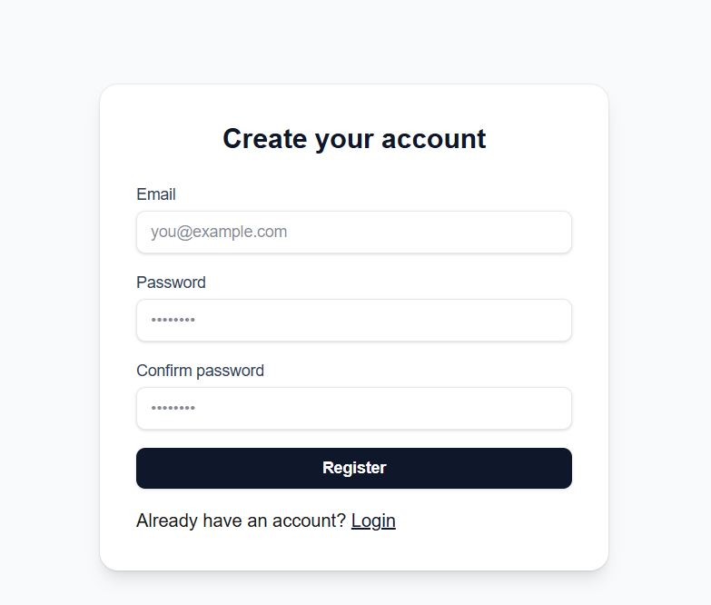
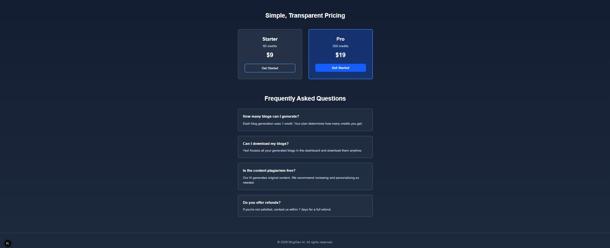
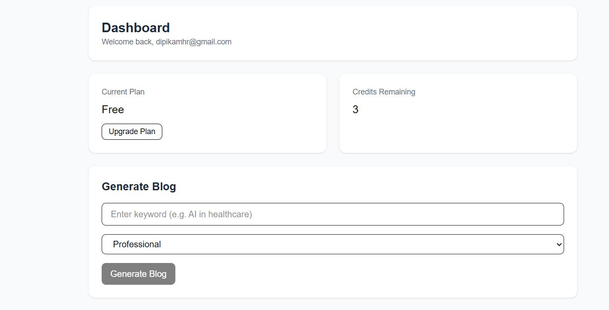

## SaaS Blog Generator

Generate SEO-optimized blog posts from keywords with AI, manage user authentication via Firebase, and monetize with Stripe subscriptions.

### Tech Stack
- **Framework**: Next.js 16.1 with TypeScript
- **Auth**: Firebase Authentication
- **Database**: Firebase Firestore
- **AI**: OpenAI GPT-4 Mini
- **Payments**: Stripe
- **Styling**: Tailwind CSS

### Features
 AI-powered SEO blog generation  
 User authentication (register/login)  
 Credit-based subscription system  
 Stripe payment integration  
 Blog history and management  
 Multiple tone options (Professional, Casual, Informative)  
 Responsive landing page  
 Dashboard with real-time stats  

### Screenshots

<p align="center">
  
</p>

<p>
  
  
</p>

<p>
  
  
</p>

<p align="center">
  
</p>

> Place image files at: `public/screenshots/` with the names used above

### Prerequisites
- Node.js 18+
- npm or yarn
- Firebase project (Firestore + Authentication)
- OpenAI API key (GPT-4 model access)
- Stripe account with API keys

### Quick Start

**1. Clone and install dependencies**
```bash
npm install
```

**2. Get your API credentials**

**Firebase Setup**:
- Create a Firebase project at [console.firebase.google.com](https://console.firebase.google.com)
- Enable Authentication (Email/Password)
- Create Firestore database (Start in test mode)
- Go to Settings > Service Accounts
- Click "Generate New Private Key" (download JSON)
- Note your client credentials from Project Settings

**OpenAI Setup**:
- Get your API key from [openai.com/api](https://platform.openai.com/api-keys)

**Stripe Setup**:
- Create Stripe account at [stripe.com](https://dashboard.stripe.com)
- Create two Products with Prices:
  - **Starter**: 50 credits at $9 (get the `price_` ID)
  - **Pro**: 200 credits at $19 (get the `price_` ID)
- Get your Secret Key from Developers > API Keys

**3. Run development server**
```bash
npm run dev
```
Open http://localhost:3000

### Key Features Explained

**Credit System**:
- Free account: 3 credits
- Starter plan: 50 credits ($9)
- Pro plan: 200 credits ($19)
- Each blog generation uses 1 credit

**SEO Optimization**:
- Structured content with headers and subheadings
- Professional copywriting
- Call-to-action sections
- Keyword-focused content

**Security**:
- Server-side user verification
- Credit validation before generation
- Secure Stripe webhook signature verification
- Firebase security rules 
